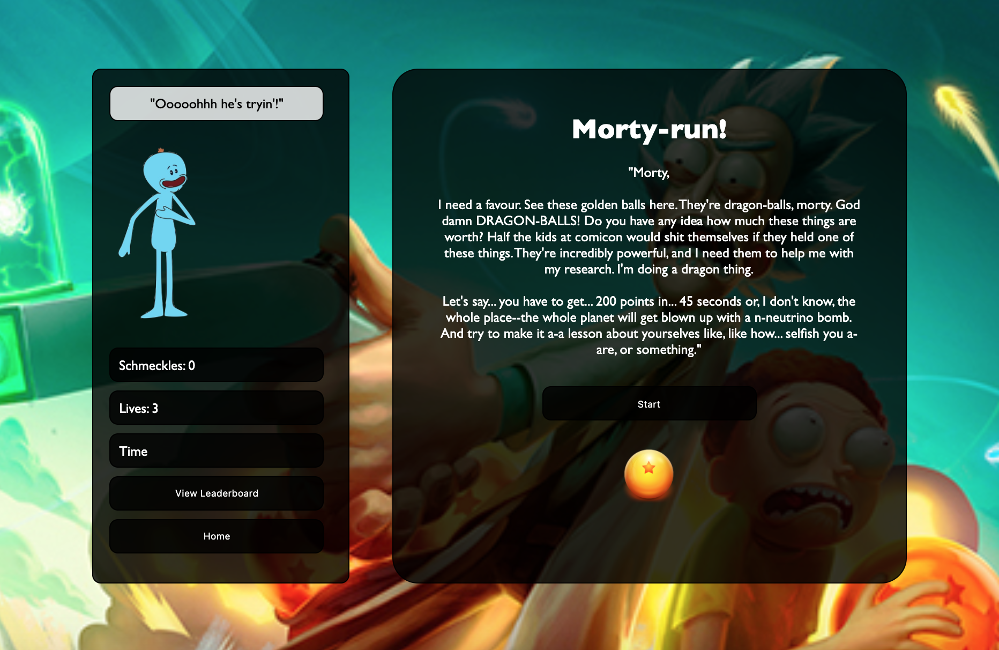
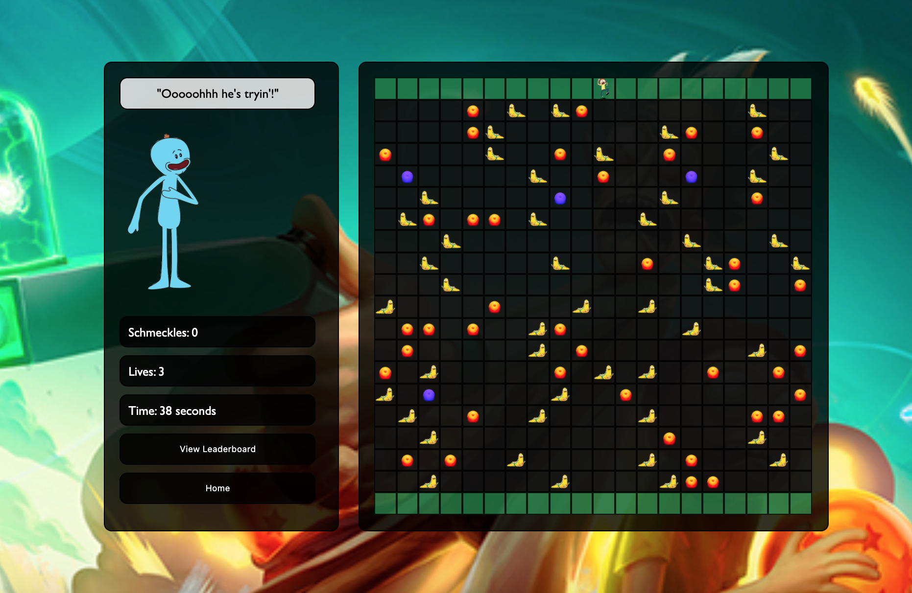
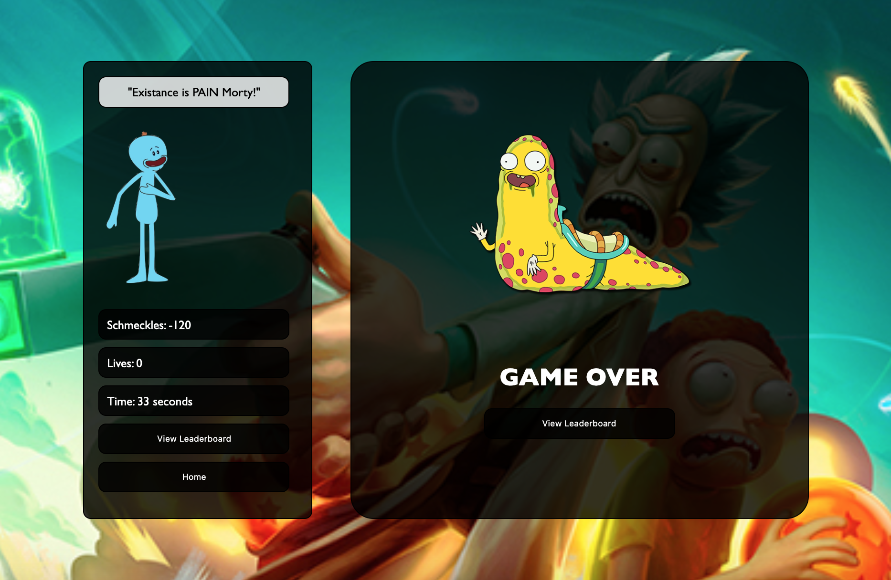
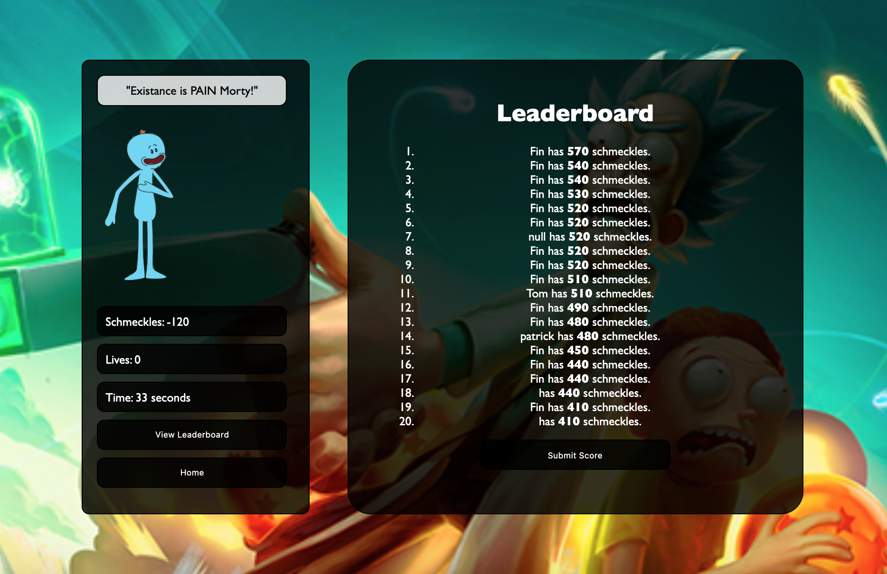
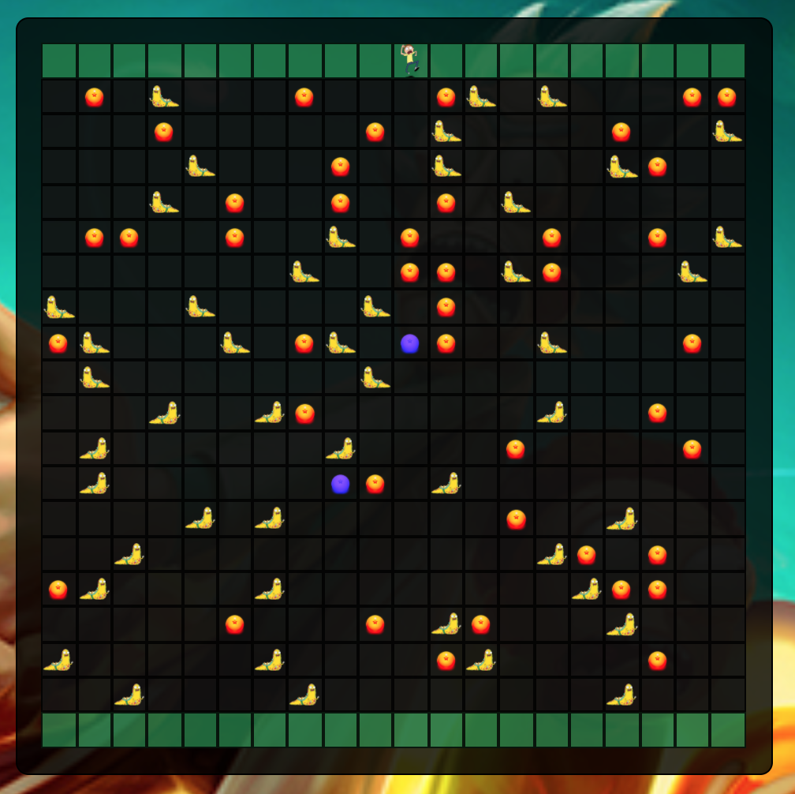

# Frogger-Game-Project
###  General Assembly, Software Engineering Immersive
# Frogger

## Overview

This was my first project on the General Assembly Software Engineering Immersive course. I Used HTML, CSS, and JavaScript to create a grid-based game that emulated the classic videogame ‘frogger’ with a ‘Rick & Morty’ twist. Your ‘Morty’ would quickly and strategicallymaneuver around the grid collecting ‘dragon-balls’, accumulating points, whilst avoidingcollisions with oncoming aliens.

## Screenshots





## How to play

- Use ← ↑ → ↓ arrow keys to move the player (Morty)
- Avoid moving aliens 
- Collect as many 'dragon balls' as you can before the timer runs out
- Orange dragon balls are worth 10 schmeckles (points)
- Blue dragon balls are worth 50 schmeckles
- If you lose a life, you lose -40 schmeckles
- The game ends when you lose all 3 lives or the time runs out

## Brief

- **Render a game in the browser**
- **Design logic for winning & visually display scoreboard**
- **Include separate HTML / CSS / JavaScript files**
- Stick with **KISS (Keep It Simple Stupid)** and **DRY (Don't Repeat Yourself)** principles
- Use **Javascript** for **DOM manipulation**
- **Deploy your game online**, where the rest of the world can access it
- Use **semantic markup** for HTML and CSS (adhere to best practices)

## Technologies Used

- HTML
- CSS
- JavaScript (ES6)
- Git and GitHub
- Google Fonts
- IMGBIN

## Approach

### The Grid

I started by creating a 20 x 20 grid using JavaScript. Below, you can see the variables used to achieve this. It was important to remind myself not to think of the grid as a grid at all, but rather an array of cells, each with individual cell IDs. Each cell has a cell ID. The numbers you see in the array variables and the morty variable all represent a specific cell.

```js
const width = 20
const gridCellCount = width * width
const cells = []
```

I then had to decide on the starting points for my Morty, dragon balls, and aliens. We can see Morty starting position is cell id 10. There are, however, many dragon balls and aliens featured on the grid.

There are two types of aliens; aliens moving left to right and aliens moving right to left. For that reason, I had to create two variable arrays; carsArrayLeft and carsArrayRight. The dragon balls are also in 2 array variables referred to as cellArrayLeft and cellArrayRight.

It must be noted that originally the aliens were supposed to be cars. In hindsight, I should have gone back to correct these variables, renaming the alienArray. I found this to be a valuable lesson, however, when it came to future projects. I believe it gave me an appriciation for the importance of naming variables.

```js
let morty = 10
const carsArrayLeft = [20, 29, 38, 45, 57, 62, 70, 77, 89, 99, 105, 114, 124, 133, 139, 146, 150, 155, 160, 167, 171, 174, 187, 195]
const carsArrayRight = [200, 208, 217, 222, 235, 245, 255, 260, 270, 278, 288, 296, 300, 309, 315, 325, 330, 340, 346, 354, 361, 370, 376]

const cellsArrayRight = [19, 39, 59, 79, 99, 119, 139, 159, 179, 199, 219, 239, 259, 279, 299, 319, 339, 359, 379, 399]
const cellsArrayLeft = [0, 20, 40, 60, 80, 100, 120, 140, 160, 180, 200, 220, 240, 260, 280, 300, 320, 340, 360, 380]
```



### Movement

There were 3 seperate movement functions I had to create; a function for Morty, a function for moving aliens left, and a function for moving aliens right. A set interval was used, with a for loop, to move each array of objects. Once the objects reached the end of each row, **classlist.remove** was used to remove the array and then **classlist.add**, added the array back to the start of the row.

```js
  function moveMorty() {
    if (gameFinished === true) {
      return
    } else {
      document.addEventListener('keydown', (event) => {
        if (event.key === 'ArrowRight') {
          if (cellsArrayRight.includes(morty)) {
            return
          } else if (morty === cells.length - 1) {
            return
          }
          cells[morty].classList.remove('morty')
          morty += 1
          cells[morty].classList.add('morty')
        } else if (event.key === 'ArrowLeft') {
          if (cellsArrayLeft.includes(morty)) {
            return
          } else if (morty === 0) {
            return
          }
          cells[morty].classList.remove('morty')
          morty -= 1
          cells[morty].classList.add('morty')
        } else if (event.key === 'ArrowUp') {
          if (morty < width) {
            return
          }
          cells[morty].classList.remove('morty')
          morty -= width
          cells[morty].classList.add('morty')
        } else if (event.key === 'ArrowDown') {
          if (morty > cells.length - width - 1) {
            return
          }
          cells[morty].classList.remove('morty')
          morty += width
          cells[morty].classList.add('morty')
        }
        timer()
        dragonBalls()
      })
    }
  }
```

```js
  function moveCarsRight() {
    // setting interval for all the cars
    carRightIntervalId = setInterval(() => {
      // mortyDies()
      // looping through each car
      for (let i = 0; i < carsArrayRight.length; i++) {
        // checking if car is at the end of the row. If the remainder of carsArray[i] divided by width is equal to 19, then we know it's hit the edge of the grid.
        if (carsArrayRight[i] % width === (width - 1)) {
          // If true, we remove class 'cars' from current cell
          cells[carsArrayRight[i]].classList.remove('carRight')
          // we reassign carsArray[i] to equal carsArray[i] - width (beginning of row)
          carsArrayRight[i] = carsArrayRight[i] - width
        }
        // currently = cell 359
        cells[carsArrayRight[i]].classList.remove('carRight')

        carsArrayRight[i]++
        // add 1 cell to equal cell 360
        cells[carsArrayRight[i]].classList.add('carRight')
        // adding car to 360
      }

    }, 300)
  }
```
### Collisions

Once I had established the movement of Morty and the aliens, I had come up with a function that would essentially kill Morty when he occupied the same cell as an alien. This function was more appropriately named **mortyDies**. This function returns Morty to his original starting cell ID of 10, -1 of his lives, and -40 schmeckles from the player's score. You can also see as a style classlist on the lives counter, which triggers the counter to pulse red when the function is called.

```js
  function mortyDies() {

    const livesCounter = document.querySelector('#livesCounter')
    const mrMeeseeksSpeachBox = document.querySelector('.mrMeeseeksSpeachBox')
    const scoreCounter = document.querySelector('#scoreCounter')

    for (let i = 0; i < 399; i++) {
      if (carsArrayLeft.includes(morty) || carsArrayRight.includes(morty)) {
        console.log('hit')
        cells[morty].classList.remove('morty')
        morty = 10
        cells[morty].classList.add('morty')
        livesCounter.innerHTML = `Lives: ${lives -= 1}`
        mrMeeseeksSpeachBox.innerHTML = '"Existance is PAIN Morty!"'
        scoreCounter.innerHTML = `Schmeckles: ${score -= 40}`
        audioMortyDies.play()
        livesCounter.classList.add('livesPulse1')
        setTimeout(() => {
          livesCounter.classList.remove('livesPulse1')
        }, 2000)
      }
    }
  }
```
I also need a function for the dragon balls collision. If morty occupied the same cell as a dragon ball, I needed the function to remove the dragon ball and add schmeckles to the schmeckles counter depending on the colour of the dragon ball. We can see this in the **dragonBalls** function below.

```js
 function dragonBalls() {

    const scoreCounter = document.querySelector('#scoreCounter')
    const mrMeeseeksSpeachBox = document.querySelector('.mrMeeseeksSpeachBox')

    for (let i = 0; i < 399; i++) {
      if (cells[i].className.includes('morty') && cells[i].className.includes('dragonBalls')) {
        cells[i].classList.remove('dragonBalls')
        scoreCounter.innerHTML = `Schmeckles: ${score += 10}`
        audioCoin.play()
        if (score < 50) {
          document.getElementById('scoreCounter').style.backgroundColor = 'rgba(200, 0, 0, 0.5)'
          mrMeeseeksSpeachBox.innerHTML = '"Oooohh yeeaahhh"'
        } else if (score > 130) {
          document.getElementById('scoreCounter').style.backgroundColor = 'rgba(0, 230, 64, 0.5)'
        } else {
          document.getElementById('scoreCounter').style.backgroundColor = 'rgba(0, 0, 0, 0.5)'
        }
      }
      if (cells[i].className.includes('morty') && cells[i].className.includes('blueDragonBalls')) {
        cells[i].classList.remove('blueDragonBalls')
        scoreCounter.innerHTML = `Schmeckles: ${score += 50}`
        audioMyMan.play()
      }
    }
  }
  ```
  ### Game Over
  I now needed a game over function to be called when either the timer ran out or the lives counter reached 0. This can be seen in the function below.

  ```js
   function gameOver() {

    backgroundAudio.pause()
    audioOwee.play()
    timeCounter.classList.remove('secondsPulse')

    const grid = document.querySelector('.grid')
    const gameOverScreen = document.querySelector('.gameOverScreen')
    const viewLeaderboardButton = document.querySelector('#viewLeaderboardButton2')

    if (lives === 0 || count === 0) {

      gameFinished = true
      clearInterval(carRightIntervalId)
      clearInterval(carLeftIntervalId)
      clearInterval(mortyDiesIntervalId)
      grid.style.display = 'none'
      gameOverScreen.style.display = 'block'
    }

    viewLeaderboardButton2.addEventListener('click', () => {
      console.log('eventListener')
      loadLeaderboard()
    })
  }
  ```
### Leaderboard
I was keen to add a more competitive element to the game. I wanted players to see their score ranking amongst their piers. The data was stored in local storage.

```js
    if (localStorage) {
      const players = JSON.parse(localStorage.getItem('players'))
      if (players) {
        scores = players
        renderList(scores, scoresList)
      }
    }
```

I only wanted a player to be submitted to the local storage leaderboard if they had placed in the top 20 scores. That's where the following if statements came to use.

```js
    addScoreButton.addEventListener('click', () => {
      const newName = prompt('Enter player name')
      const player = { name: newName, playerScore: score }
      console.log(scores)
      if (score > scores[19].playerScore) {
        console.log('yes')
        scores.pop()
        scores.push(player)
        audioDubDub.play()
      }
      renderList(scores, scoresList)

      if (localStorage) {
        localStorage.setItem('players', JSON.stringify(scores))
      }
    })
  }
```
If the player successfully made the top 20, their name and score were mapped over the leaderboard array and placed in the according position, popping out 20th in the array and pushing the new score back in.

```js
  function renderList(scores, scoresList) {
    const array = scores.sort((playerA, playerB) => playerB.playerScore - playerA.playerScore).map(player => {
      return `<li>
        ${player.name} has <strong>${player.playerScore}</strong> schmeckles.
      </li>`
    })
    scoresList.innerHTML = array.join('')
  }
}
```
## Future Additions
- Make the game mobile friendly
- Have the leaderboard made public to been viewed on any server
- Create additional levels

## Key Lessons Learned
- Spend time thinking abou what functions you will require and how they will communicate with one another before diving into the code
- Naming variables apropriately

